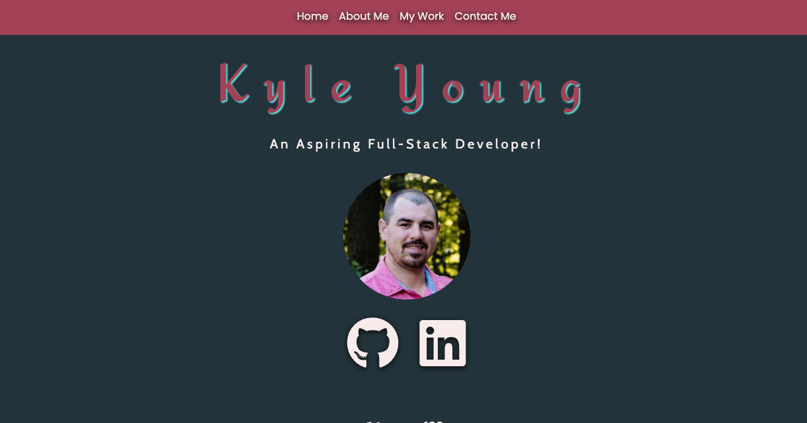
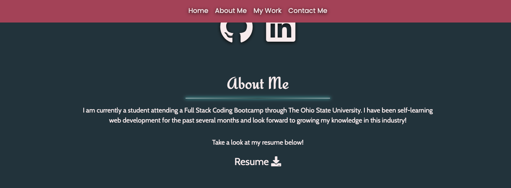
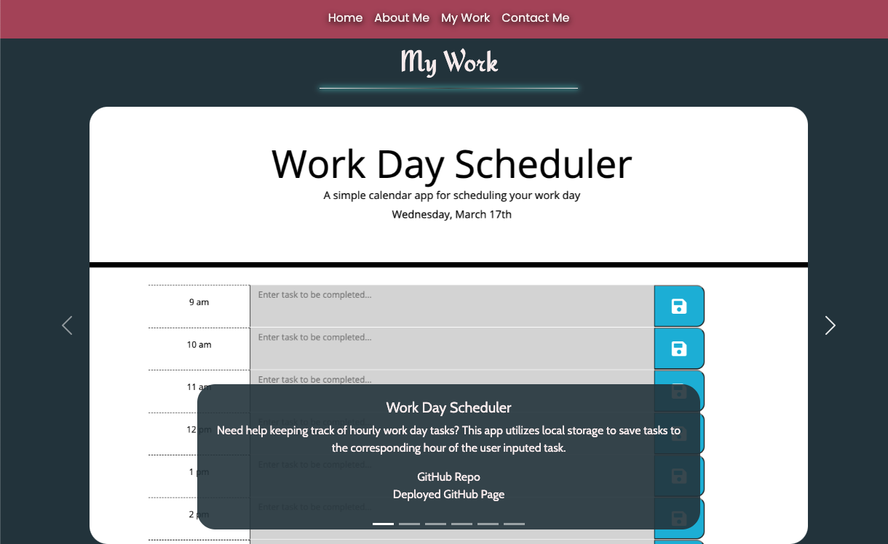
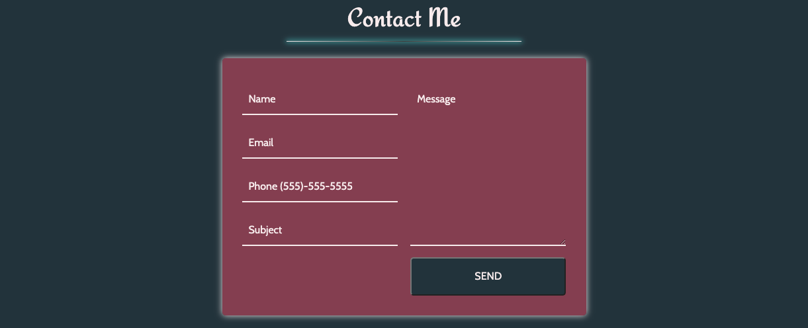

# UpdatedPortfolio

Week 8 Homework for OSU Bootcamp

## Description

This is an updated version of my previous portfolio. Using Bootstrap to help make it more mobile friendly.

Check it out here https://youngin9210.github.io/UpdatedPortfolio/

## Table of Contents

- [Screenshots](#screenshots)
- [Installation](#installation)
- [Credits](#credits)
- [License](#license)
- [Badges](#badges)

## Screenshots

### Nav and Header

### About Me section

### My Work

### Contact Me

## Installation

Using the terminal, clone the repository to your local device using SSH or HTTPS. Once cloned, open repository in a text editor to make changes.

## Credits

Kyle Young https://github.com/Youngin9210

## License

## Badges

